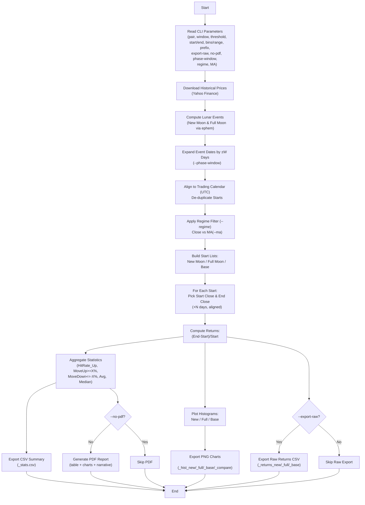

# 🌕 Lunar Phase Crypto Backtester

**Lunar Phase Crypto Backtester** is a backtesting tool that analyzes the relationship between lunar phases (New Moon & Full Moon) and crypto asset returns over a given time window.

It uses historical price data from Yahoo Finance and lunar phase data from the `ephem` library, and produces:
- **Statistical summary table** for each phase.
- **Return distribution histograms** for New Moon, Full Moon, and baseline periods.
- **Overlay histogram comparison**.
- **PDF report** with **auto-generated analysis narrative**.
- *(Optional)* Raw CSV export for detailed data analysis.

---

## ✨ Features

- **Multi-asset support** – works with any ticker available on Yahoo Finance (`--pair BTC-USD`, `ETH-USD`, etc.).
- **Flexible parameters**:
  - `--threshold`: Minimum move to count as significant.
  - `--window`: Return calculation window (days).
  - `--start` / `--end`: Custom backtest date range.
  - `--bins` & `--range`: Histogram customization.
- **Export raw data** – save per-category returns to CSV (`--export-raw`).
- **Professional PDF report** – includes table, charts, and commentary.
- **CLI only** – no code edits required.

---

## 📦 Installation

### 1. Clone the repository
```bash
git clone https://github.com/irfanfiles/lunar-phase-crypto-backtester.git
cd lunar-phase-crypto-backtester
```

---

## 📊 Process Flowchart


